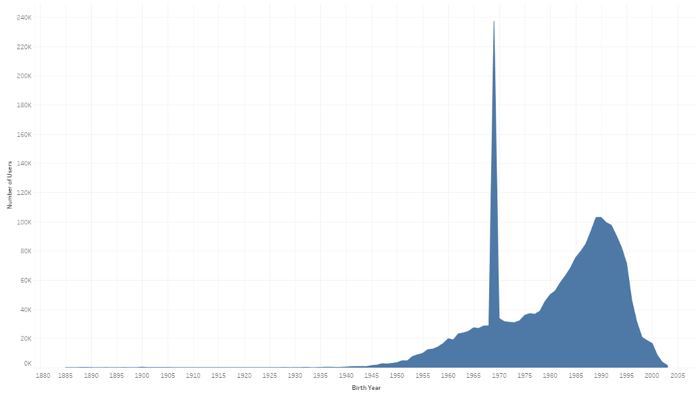
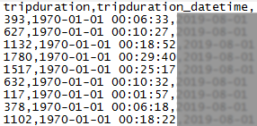
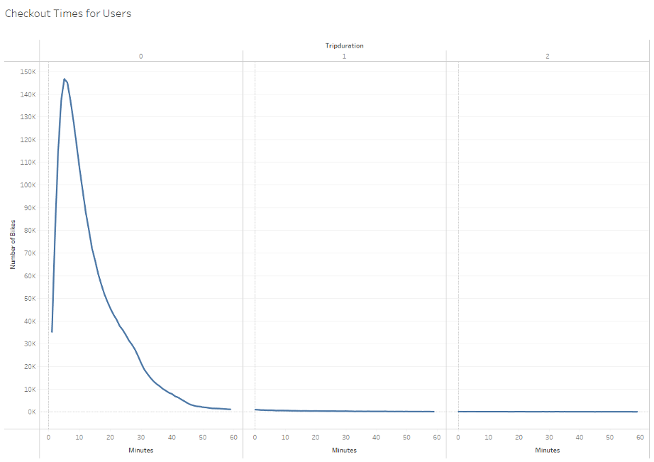
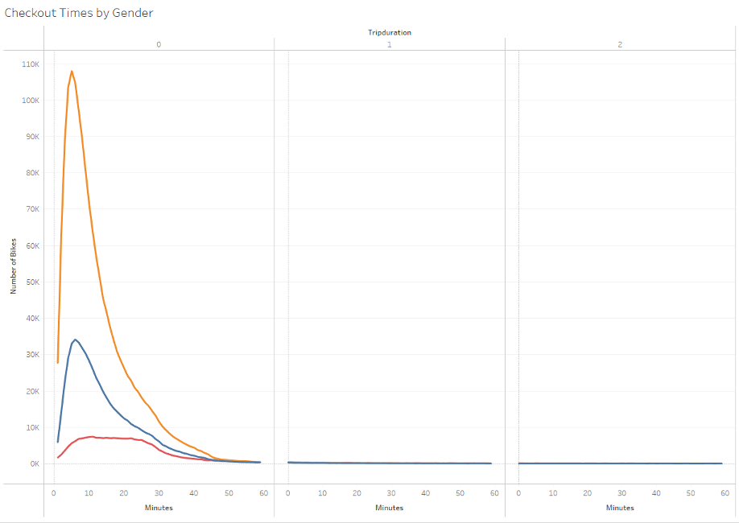
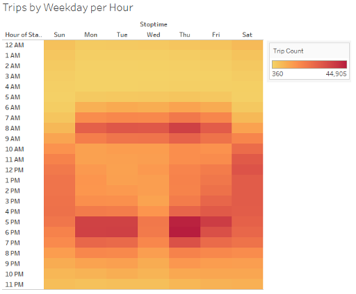
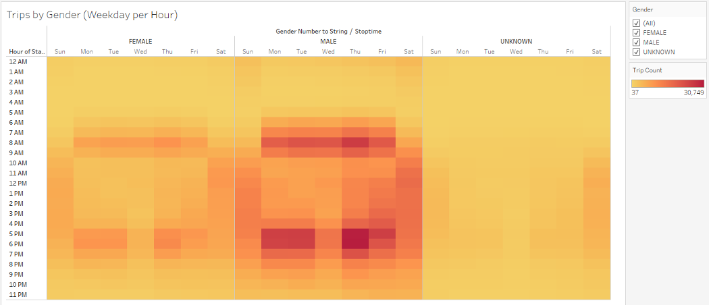
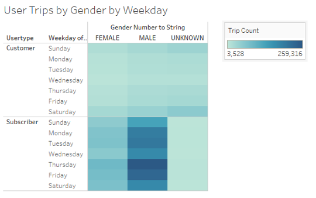
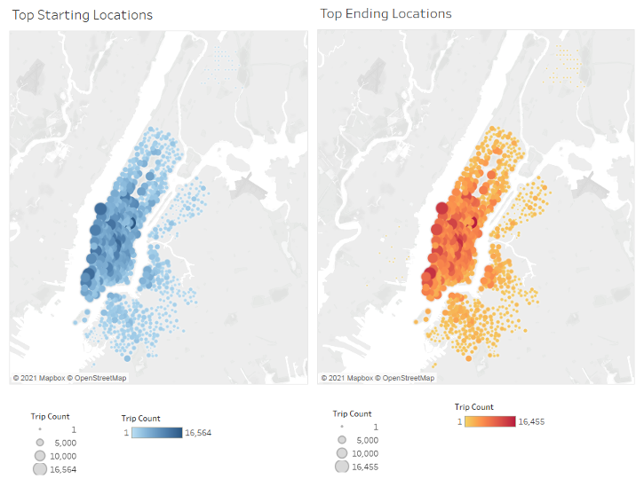

# Module 14 Challenge - Bikesharing - Tableau

## Overview

### Purpose

The purpose of this project is to visualize bikesharing data from
New York City using Tableau.

The time chosen for analysis is the one-month period of August, 2019.

### Deliverables

1. Change Trip Duration to a Datetime Format
2. Create Visualizations for the Trip Analysis
3. Create a Story and Report for the Final Presentation

### Resources

- Software:
	- Jupyter notebook server 6.3.0, running Python 3.7.10 64-bit (Dependencies: OS, Pandas)
	- Tableau Public Desktop 2021-2-2 64-bit
- Data:
	- New York City Citi Bike Bikeshare System Data
	    - URL: https://www.citibikenyc.com/system-data
	    - File: `201908-citibike-tripdata.csv`
	    - Resource URL: https://s3.amazonaws.com/tripdata/201908-citibike-tripdata.csv.zip
	    - Accessed: 2021-09-06
	- `NYC_CitiBike_Challenge_starter_code.ipynb`
	    - Jupyter Notebook File provided by Client
	    - Copied and renamed to `NYC_Citibike_Challenge.ipynb`
	    - Python Code Added to change `201908-citibike-tripdata.csv` `tripduration` to a Datetime Format
	- `201908-citibike-tripdata_DATETIME.csv`
		- User-created datafile result of export from `NYC_Citibike_Challenge.ipynb`
		- Identical to `201908-citibike-tripdata.csv` with the exception of transformation performed on Column 1, `tripduration`, as described above.

#### Data Quality

Some care should be taken before drawing absolute conclusions based on some of the available information, 
as noted below.

`tripduration`: There are no NULL values present here, and as originally presented in `201908-citibike-tripdata.csv`, all trips
with durations less than 60 seconds have been removed. There are some trips which should warrant further investigation.
Out of the 2,344,224 trips contained in this dataset, there are 588 with durations greater than 24 hours, the longest
being over 1,000 hours, which would be nearly a month-and-a-half of continuous usage. While not impossible, these long rentals
should be investigated for errors, or system abuse. A good starting point would be to investigate all rentals longer than 12 hours. As an example
of the proportion of rides this would represent, the number of rides in this corpus longer than 12 hours is 1,096 out of 2.3 Million, or
approximately 0.05%.

`starttime`: There are no NULL values, and as expected (or, hoped), all starttimes are contained within the Month of August, 2019. There are rentals for each day of the month.

`stoptime`: There are no NULL values. Each starttime subtracted from each stoptime represented corresponds to the accompanying tripduration present in the record. This lends
credence to the hypothesis that long rentals are legitimate, but they should still be investigated for system abuse (and payment!). The longest rentals conclude in the
month of September, 2019.

`start station id`, `start station name`, `end station id`, `end station name`: There are 89 rental records for which each of these fields is NULL. Out of the 13,983 unique bikeid's in the
system at the time under consideration, these 89 records are related to 16 unique bicycles. Nearly half of these records (44) are related to only two bicycles. It cannot be determined
at this time how these 89 records came into existence without station metadata, but investigating the bicycles in question is one good starting point. If they could be traced to individual
users as well, this could yield some clues, but using the information currently available in this public dataset, this operation is not possible. The NULL Stations are 47 in number, each
with latitude and longitude locations which do not correspond to any of the other latitude and longitude locations of the other 807 stations present in the corpus at the time of analysis.

`start station latitude`, `start station longitude`, `end station latitude`, `end station longitude`: There are no NULL values, and as expected (or, hoped), all stations are present
within the geographic bounds of the New York City Greater Metropolitan Area and nearby surrounding areas. It should be noted that during the time under consideration, there are end stations in New Jersey
which are not being used as start stations, at least in this dataset. This could be rectified by comparing stations against the Jersey City dataset also hosted on the New York City
City Bike Bikeshare website, to see if there are corresponding trips being taken from New Jersey into New York. This should be monitored and crosschecked to ensure that over time, all of
New York City's Bicycles don't migrate to New Jersey without sufficient numbers of bicycles being brought back to take their place.

`birth year` (a data point rife with errors in self-reporting): According to the [Citi Bike Bicycle Rental Agreement](https://assets.citibikenyc.com/rental-agreement.html "Rental Agreement"),
no person under 16 years of age may ride a Citi Bike Bicycle, and a Minor between the Ages of 16 and 18 may ride with permission and payment of a Parent or Legal Guardian.
Furthermore, "You may not ride a Bicycle in New Jersey if You are under 17 years of age and are not wearing a helmet."

According to the dataset, the age restrictions are being properly enforced and adhered to, as there are no entries with a user under the age of 16. However, due to the more accessible
nature of the service for users aged 18 and over, one might expect that some minors are exaggerating their ages to avoid having to involve a Parent
or Legal Guardian in their procurement of Bicycle Sharing Services, or if they desire to ride in New Jersey without wearing a helmet.

On the upper end of the age spectrum, there are other issues of data reliability.  There are 983 entries during this period of users who would have been over 100 years old at the time of use,
with the oldest reported birth year on record being 1885. There is a large cluster of 325 users with a reported birth year of 1900 which would suggest that '1900' is being
populated as a default when the birth year has otherwise been left blank. Credence is further lent to this hypothesis according to the fact that there are no otherwise NULL values
in the birth year corpus.

Most of these errant values can likely be attributed to miskeying errors during data entry or transcription. Without implementing
a more sophisticated date-checking mechanism, a simple cutoff to discourage an excessive amount of false entries would be to enforce
years post-1900 on input.

One other glaring instance of the unreliability of user-supplied data is the highly unusual number of users with a stated birth year of 1969, 237,533 of whom rented bikes in August. This represents
over 10% of all rentals in this reported birth year alone. Just how drastic this differs from all other reported years can be seen here in Figure 1:

**Figure 1: "Sixty-Nine, Bro"**

Schoolyard humor is evergreen, but should not be relied upon for robust data analysis. If `birth year` is to be used at all for any sort of analysis,
records with a reported birth year of 1969 or such that would make the user over 100 years old at the time of rental should be disregarded.

If the self-reported gender is to be trusted for 1969 spoofers (dubious, at best), the male instance appears roughly 3 times as frequently as the female instance, surprising no-one.

Thankfully, the only other data field that appears to be user-supplied is `gender`; all other data fields are machine-generated.

`bikeid`, `usertype`, `gender`: No NULL values present, no other obvious errors or inconsistencies identified.

## Deliverables

### Deliverable 1

See `NYC_CitiBike_Challenge.ipynb` and `Images/201908-citibike-tripdata_DATETIME_sample.png`

Note: `201908-citibike-tripdata_DATETIME.csv` not uploaded to conserve disk space (2,344,225 Lines; 459 MB).

A Screenshot of a Sample of the Datetime converted datafile is shown here in Figure 2:

**Figure 2: Sample of `201908-citibike-tripdata_DATETIME_sample.png` Highlighting the First Column in hours, minutes, seconds (HH:mm:ss)**

### Deliverable 2

See Tableau Public Visualization:

[https://public.tableau.com/app/profile/tpapiernik/viz/Module_14_Challenge_NYC_Bikesharing/NYCBikesharingStory](https://public.tableau.com/app/profile/tpapiernik/viz/Module_14_Challenge_NYC_Bikesharing/NYCBikesharingStory "Tableau Public Visualization")

### Deliverable 3

See Tableau Public Visualization

[https://public.tableau.com/app/profile/tpapiernik/viz/Module_14_Challenge_NYC_Bikesharing/NYCBikesharingStory](https://public.tableau.com/app/profile/tpapiernik/viz/Module_14_Challenge_NYC_Bikesharing/NYCBikesharingStory "Tableau Public Visualization")

## Results

Below is a gallery of the visualizations generated in the Tableau Public Visualization File, along with a brief description of each below the figure.

**Figure 3: Visualization 1**

Description: (Goes Here)

**Figure 4: Visualization 2**

Description: (Goes Here)

**Figure 5: Visualization 3**

Description: (Goes Here)

**Figure 6: Visualization 4**

Description: (Goes Here)

**Figure 7: Visualization 5**

Description: (Goes Here)

**Figure 8: Visualization 6**

Description: (Goes Here)

**Figure 9: Visualization 7**

Description: (Goes Here)

## Summary

Lorem ipsum dolor sit amet, consectetuer adipiscing elit. Integer diam augue, egestas quis, aliquam ut, venenatis ut, quam. Quisque ut augue. Integer non neque a lectus venenatis fermentum. Morbi quis eros nec elit molestie vehicula. Integer nunc lacus, sodales posuere, rutrum quis, blandit at, mi. Vivamus imperdiet wisi vel mauris. Morbi mattis ante non metus. Sed turpis dui, fermentum ut, aliquam eget, vulputate ullamcorper, pede. Nam non dolor. Etiam lobortis, urna id bibendum convallis, ligula augue auctor eros, a dictum sapien mi a tellus. Proin vel justo. Nunc malesuada turpis a sapien.

### Suggestions for Future Analysis

1. Suggestion #1
2. Suggestion #2

-- END --
